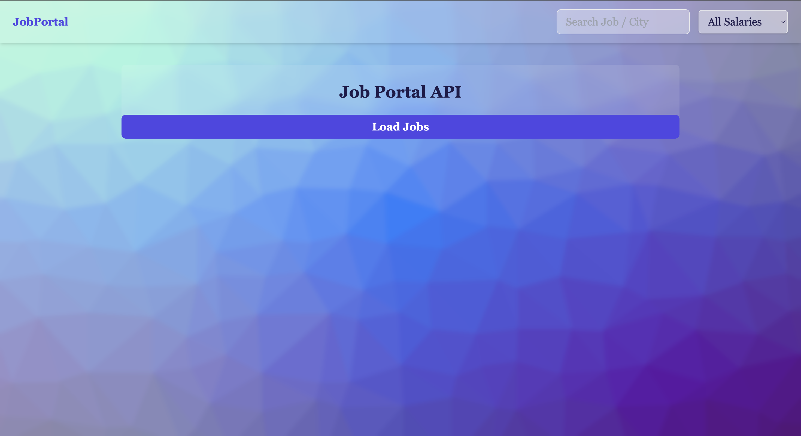
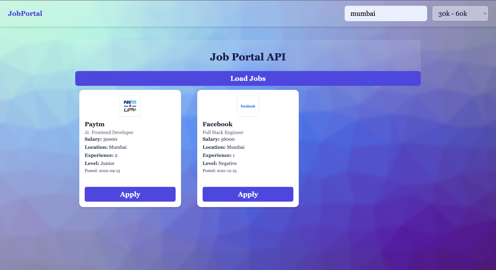
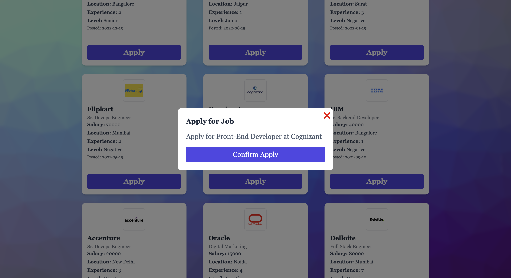

# Job Portal Application

A responsive Job Portal built using HTML, Tailwind CSS, and JavaScript.

## Features
- Load jobs from JSON API
- Search jobs by role, company, or location
- Salary range filter
- Modal-based job application
- Prevent duplicate applications
- Applied jobs stored in localStorage
- Clean, responsive UI using Tailwind CSS

## Tech Stack
- HTML
- Tailwind CSS
- JavaScript (ES6)
- LocalStorage

## Learning Outcome
This project helped me understand DOM manipulation, filtering logic, UI state handling, and real-world frontend workflows.

## Screenshots

### Home Page

